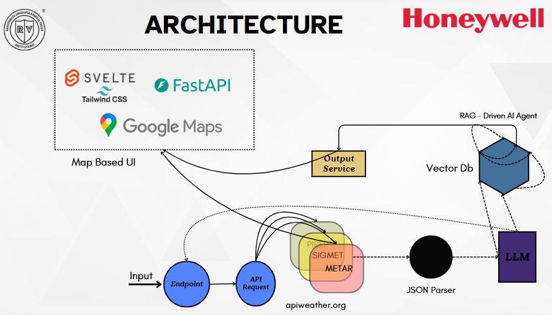

# Aviation-Insight

## Overview
Aviation-Insight is a comprehensive aviation weather dashboard that provides real-time weather data for pilots and aviation enthusiasts. The application fetches data from the Aviation Weather Center API and displays it in an intuitive, user-friendly interface, allowing users to visualize flight routes and access critical weather information.

## Key Features

- **Interactive Flight Route Visualization**:
  - Enter a flight plan with waypoints and altitudes
  - View the route on an interactive US map with all waypoints clearly marked
  - See comprehensive weather details for each waypoint on hover
  - Visualize altitude profile for the entire flight

- **Complete Weather Data Integration**:
  - METAR (Current Conditions) - Real-time weather observations
  - TAF (Terminal Aerodrome Forecasts) - Weather forecasts for airports
  - PIREP (Pilot Reports) - Weather conditions reported by pilots
  - SIGMET (Significant Meteorological Information) - Warnings about hazardous weather

- **Advanced Search Capabilities**:
  - Search for weather stations by ICAO code, name, or location
  - Radius-based search for finding stations near specific coordinates
  - Filter and sort weather data based on various parameters

- **Data Visualization**:
  - Interactive maps with weather overlays
  - Altitude profile charts
  - Temperature and wind visualizations
  - Cloud coverage and visibility indicators

## Architecture



The architecture diagram above illustrates the system components and data flow of the Aviation-Insight application.

## Technology Stack

- **Frontend**: Streamlit for a responsive and interactive UI
- **Backend**: Python for data processing and API integration
- **Data Visualization**: Plotly, Folium for maps and charts
- **API**: Aviation Weather Center API with rate-limiting implementation

## Installation

```bash
# Clone the repository
git clone https://github.com/yourusername/Aviation-Insight.git

# Navigate to the project directory
cd Aviation-Insight

# Install dependencies
pip install -r requirements.txt

# Run the application
streamlit run app.py
```

## Usage

### Flight Plan Mode
1. Select "Flight Plan" from the navigation sidebar
2. Enter your flight plan in the format: `ICAO,Altitude,ICAO,Altitude,...`
   - Example: `KPHX,1500,KBXK,12000,KPSP,20000,KLAX,50`
3. Click "Submit Flight Plan" to view:
   - Route map with all waypoints
   - Weather details for each waypoint
   - Altitude profile
   - Comprehensive weather information

### Station Search Mode
1. Select "Station Search" from the navigation sidebar
2. Search for stations by:
   - ICAO code or name
   - Geographic coordinates with a specified radius
3. View detailed weather information for the selected station

## Demo

[Watch the Demo Video](https://placeholder-for-demo-video.com)

## Contributors

- **Chirag**: Lead developer, backend architecture, API integration
- **Smruthi**: Frontend development, UI/UX design, data visualization
- **Aditya**: Data processing, testing, documentation

## API Reference

This project uses the [Aviation Weather Center API](https://aviationweather.gov/data/api/) to fetch weather data. The API provides access to various types of aviation weather information, including:

- METAR (Meteorological Aerodrome Report)
- TAF (Terminal Aerodrome Forecast)
- PIREP (Pilot Report)
- SIGMET (Significant Meteorological Information)

The application implements rate limiting to respect the API's limit of 1 request per minute per thread.

## Future Enhancements

- Weather trend analysis and forecasting
- Integration with flight planning tools
- Mobile application development
- Offline mode with cached data
- User accounts for saving favorite routes and stations

## License

This project is licensed under the MIT License - see the LICENSE file for details.

## Acknowledgements

- Aviation Weather Center for providing the comprehensive API
- Streamlit for the powerful web application framework
- All contributors who have helped make this project better
